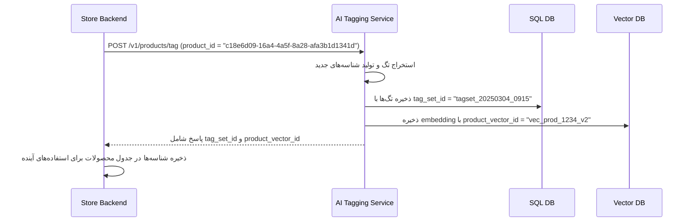
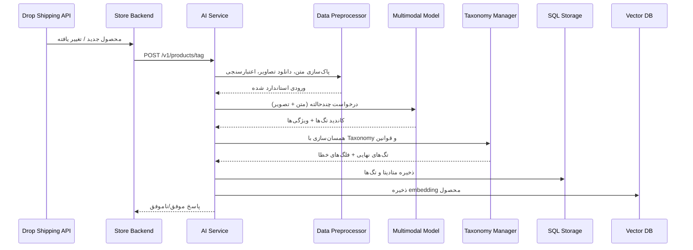

 سرویس برچسب‌گذاری محصول

## ۱. هدف سرویس
- **تبدیل داده خام محصول** (نام، توضیحات، تصاویر و متادیتا از سرویس دراپ‌شیپینگ) به مجموعه‌ای از تگ‌های ساخت‌یافته که با Taxonomy فروشگاه سازگار است.
- **استخراج ویژگی‌های کلیدی** مانند سبک، متریال، رنگ غالب، فصل مناسب، جنسیت هدف، الگو و مناسبت.
- **تهیه بردار معنایی** برای هر محصول جهت استفاده در موتور پیشنهاد و جستجوی مشابهت.

## ۲. ورودی‌ها و خروجی‌ها
- **ورودی‌ها**
  - Payload محصول از سرویس دراپ‌شیپینگ (`product_id`, `title`, `description`, `category`, `image`, `attributes`, `price`, `brand`).  
    - `product_id` باید UUID یکتا باشد تا همسان‌سازی بین بک‌اند فروشگاه و سرویس AI تضمین شود.
  - گزینه‌های اختیاری (`options`): پارامترهایی برای تنظیم رفتار سرویس در هر درخواست.
    - **نمونه پارامترها**:
      - `taxonomy_strictness`: میزان سخت‌گیری در پذیرش تگ‌هایی که دقیقاً با Taxonomy داخلی همخوانی دارند (مقادیر پیشنهادی: `strict`, `moderate`, `lenient`).
      - `business_rules`: شناسه یا پرچمی برای اعمال قوانین خاص برند (مثلاً عدم استفاده از برخی تگ‌ها یا اولویت دادن به دسته‌ای مشخص).
      - `force_refresh`: در حالت `true`، سرویس مجبور می‌شود حتی در صورت وجود نتیجه کش‌شده، تگ‌ها را مجدداً استخراج کند.
    - اگر `options` ارسال نشود، مقادیر پیش‌فرض سیستم اعمال می‌شود و سرویسی با تنظیمات استاندارد اجرا خواهد شد.
- **خروجی‌ها**
  - مجموعه تگ‌های استاندارد `tags[]` (کلید/مقدار).
  - امتیاز اطمینان برای هر تگ `confidence`.
  - شناسه‌های مسیریابی (`tag_set_id`, `product_vector_id`).
  - گزارش خطا یا نیاز به بازبینی انسانی (در صورت ناکافی بودن داده).

## ۳. مدیریت Taxonomy

### ۳.۱ ضرورت و فرآیند همسان‌سازی با Taxonomy
- **همسان‌سازی تگ‌ها با Taxonomy داخلی چرا ضروری است؟**
  - **یکپارچگی داده**: خروجی مدل‌ ممکن است از اصطلاحات آزاد یا واژه های متفاوت استفاده کند. بدون نگاشت به واژگان کنترل‌شده، داده‌های فروشگاه پراکنده و تحلیل‌ناپذیر می‌شوند.
  - **سازگاری با زیرسیستم‌ها**: موتور جستجو، فیلترهای فروشگاه و ماژول پیشنهاددهنده بر اساس دسته‌بندی و تگ‌های استاندارد فعلی کار می‌کنند؛ لازم است تگ‌های جدید با همان شناسه‌ها و ساختارهای موجود ذخیره شوند.
  - **مدیریت چندزبانگی**: Taxonomy داخلی می‌تواند ترجمه‌ها و معادل‌های فرهنگی را نگهداری کند تا در آینده برای بازارهای دیگر تنها با نگاشت واژگان، سیستم آماده شود.
  - **کنترل کیفیت و ممیزی**: امکان اعمال قوانین کسب‌وکاری (مثلاً محدودیت برای ترکیب برخی تگ‌ها) تنها وقتی ممکن است که تگ‌ها در قالبی قابل پیش‌بینی و استاندارد باشند.

- **گام‌های اجرایی در ماژول Taxonomy Manager**
  1. **نرمال‌سازی**: کوچک‌سازی حروف، حذف فاصله‌های اضافی، و یکنواخت‌سازی فرمت (مانند رنگ‌ها به Hex/نام استاندارد).
  2. **نگاشت (Mapping)**: استفاده از جدول تطبیق بین خروجی مدل و اصطلاحات رسمی فروشگاه (مثال: “athleisure” → `style_sporty_casual`).
  3. **اعتبارسنجی**: بررسی قواعد (Rule Engine) برای جلوگیری از تگ‌های متناقض یا ناقص.
  4. **مدیریت نسخه**: ثبت تغییرات Taxonomy برای تحلیل اثرات و امکان بازگشت به نسخه‌های پیشین.
  5. **تسری به Vector DB**: تضمین می‌کند که embeddingها با برچسب‌های نهایی و یکسان ذخیره شوند تا جستجوی مشابهت از داده استاندارد استفاده کند.

## ۴. گام‌های تفصیلی
1. **Trigger و اعتبارسنجی اولیه**
   - بک‌اند فروشگاه پس از دریافت محصول جدید یا آپدیت، شناسه محصول را به سرویس AI ارسال می‌کند.
   - بک‌اند در لحظه ثبت محصول از سرویس دراپ‌شیپینگ، یک UUID یکتا (`product_id`) تولید و در پایگاه داده خود ذخیره می‌کند؛ همان UUID باید در تمامی درخواست‌های بعدی به سرویس AI ارسال شود.
   - سرویس AI وجود فیلدهای حیاتی (`title`, `description`, حداقل یک تصویر) را بررسی می‌کند. در صورت نقص، پیام خطا با کد مشخص بازگردانده می‌شود.
2. **پیش‌ پردازش متن**
   - نرمال‌سازی (حذف HTML، فاصله اضافی، تبدیل واحدها).
   - شناسایی زبان (بایستی English باشد؛ در صورت تشخیص زبان دیگر، ترجمه یا برچسب هشدار ثبت می‌شود).
3. **آماده‌سازی تصویر**
   - اطمینان از دسترس بودن URL تصویر واحد محصول.
   - در صورت نیاز انتقال لینک به فضای امن (Object Storage) و استفاده از URL جدید.
4. **ساخت درخواست**
   - قالب پیام مطابق SDK رسمی OpenAI است: یک آرایه `content` شامل مؤلفه متنی و مؤلفه تصویر.
   - مثال:

```json
{
  "input": [
    {
      "role": "user",
      "content": [
        {
          "type": "input_text",
          "text": "Analyze the following apparel product and return JSON tags with keys [style, material, feature, color_primary, season]. Product context:\nTitle: Men's Lightweight Bomber Jacket\nDescription: Water-resistant bomber jacket with ribbed cuffs and two zip pockets.\nCategory: Outerwear > Jackets\nAttributes: material=Polyester; color=Navy"
        },
        {
          "type": "input_image",
          "image_url": "https://cdn.example.com/products/c18e6d09-16a4-4a5f-8a28-afa3b1d1341d/front.jpg"
        }
      ]
    }
  ]
}
```

5. **دریافت پاسخ مدل**
   - مدل خروجی JSON ساخت‌یافته یا متن قابل پارس بازمی‌گرداند.
   - مثال خلاصه شده:

```json
{
  "tags": [
    {"key": "style", "value": "casual", "confidence": 0.84},
    {"key": "material", "value": "polyester", "confidence": 0.76},
    {"key": "feature", "value": "water-resistant", "confidence": 0.81},
    {"key": "color_primary", "value": "navy", "confidence": 0.93},
    {"key": "season", "value": "fall", "confidence": 0.64}
  ],
  "notes": "Suitable for mild weather and layering."
}
```

6. **همسان‌سازی با Taxonomy**
   - Taxonomy Manager هر تگ را به شناسه استاندارد نگاشت می‌کند (مانند `style_casual`, `season_fall`).
   - قوانین کسب‌وکاری مانند حداقل Confidence (`>=0.6`) اعمال می‌شوند.
   - تگ‌های نامعتبر یا ناشناس در جدول `tag_anomalies` ثبت می‌شوند تا تیم محتوا بررسی کند.
7. **ذخیره‌سازی و خروجی**
   - `product_tags` با شناسه محصول و تگ‌های رسمی به‌روزرسانی می‌شود.
   - embedding محصول (ترکیب متن + تگ‌ها) محاسبه و در Vector DB ذخیره می‌گردد.
    - نتیجه نهایی همراه با نسخه Taxonomy استفاده‌شده به بک‌اند فروشگاه بازگردانده می‌شود تا در UI یا فرآیندهای بعدی استفاده گردد و همسانی نسخه‌ها کنترل شود.

### ۴.۱ مدیریت شناسه‌های مسیریابی و کاربرد آن‌ها
- **هدف از شناسه‌ها**
  - `tag_set_id`: مشخص‌کننده نسخه تگ‌های ساخته‌شده برای یک محصول در یک زمان مشخص است. با این شناسه می‌توان تاریخچه تغییر تگ‌ها را نگه داشت یا به نسخه‌های قبل بازگشت.
  - `previous_tag_set_id`: هنگام به‌روزرسانی تگ‌ها، نسخه قبلی را مشخص می‌کند تا سرویس‌ها بتوانند به‌روزرسانی را به صورت اتمیک انجام دهند یا در صورت نیاز به عقب برگردند.
  - `product_vector_id`: اشاره‌گر یکتایی به embedding محصول در Vector DB است تا سرویس‌های پیشنهاددهی و جستجوی مشابهت بتوانند به سرعت بردار مرتبط را بازیابی کنند.
  - `taxonomy_version`: نسخه‌ای از Taxonomy که برای تولید تگ‌ها استفاده شده است و باید با نسخه مورد استفاده در بک‌اند فروشگاه همسان باشد.

- **جریان داده شناسه‌ها**



- **نمونه تعامل کامل**
  1. محصول جدید با UUID `c18e6d09-16a4-4a5f-8a28-afa3b1d1341d` به سرویس AI ارسال می‌شود.
  2. سرویس AI پس از موفقیت در برچسب‌گذاری، پاسخ زیر را برمی‌گرداند:

```json
{
  "status": "success",
  "product_id": "c18e6d09-16a4-4a5f-8a28-afa3b1d1341d",
  "tag_set_id": "tagset_20250304_0915",
  "product_vector_id": "vec_c18e6d09_v2",
  "taxonomy_version": "tx_2025_03_01",
  "tags": [
    {"key": "style", "value": "streetwear", "confidence": 0.79},
    {"key": "season", "value": "spring", "confidence": 0.68}
  ]
}
```

  3. بک‌اند فروشگاه این شناسه‌ها را کنار محصول ذخیره می‌کند.
  4. در به‌روزرسانی بعدی (مثلاً تغییر توضیحات محصول)، درخواست جدید شامل همان `product_id` و `tag_set_id` قبلی ارسال می‌شود تا سرویس AI بداند نسخه پیشین متعلق به کدام رکورد است و نسخه تازه را به‌روزرسانی کند.
  5. موتور پیشنهاددهی هنگام نیاز به محاسبه شباهت، با استفاده از `product_vector_id` مستقیماً embedding محصول را از Vector DB واکشی می‌کند.

- **مثال به‌روزرسانی نسخه تگ**
  - درخواست:

```json
{
  "product_id": "c18e6d09-16a4-4a5f-8a28-afa3b1d1341d",
  "tag_set_id": "tagset_20250304_0915",
  "title": "Lightweight Bomber Jacket with Mesh Lining",
  "description": "Updated description with new features...",
  "image": "https://cdn.store.com/products/c18e6d09-16a4-4a5f-8a28-afa3b1d1341d/front_v2.jpg",
  "options": {"taxonomy_strictness": "strict"}
}
```

  - پاسخ:

```json
{
  "status": "success",
  "product_id": "c18e6d09-16a4-4a5f-8a28-afa3b1d1341d",
  "tag_set_id": "tagset_20250512_1432",
  "previous_tag_set_id": "tagset_20250304_0915",
  "product_vector_id": "vec_c18e6d09_v3",
  "taxonomy_version": "tx_2025_05_10",
  "tags": [
    {"key": "feature", "value": "mesh_lining", "confidence": 0.81},
    {"key": "season", "value": "spring", "confidence": 0.7}
  ]
}
```

- **مثال مصرف در موتور پیشنهاد**
  1. سرویس پیشنهاددهنده نیاز به لیست محصولات مشابه دارد و با استفاده از `product_vector_id = "vec_c18e6d09_v3"` به Vector DB درخواست می‌زند:

```
similarity_search(vector_id="vec_c18e6d09_v3", top_k=5)
```

  2. نتیجه شامل شناسه‌های محصول مشابه و امتیاز شباهت بازمی‌گردد:

```json
[
  {"product_id": "9e23f6b4-3c6b-45b3-99f4-df41f6cc8a2c", "score": 0.88},
  {"product_id": "54af9c2d-6f21-481e-8f89-8455a8d27f16", "score": 0.86},
  {"product_id": "4f8d0b53-0f25-4d02-8f6e-6072c70a0a5b", "score": 0.84}
]
```

  3. این شناسه‌ها دوباره به بک‌اند فروشگاه ارسال می‌شوند تا جزئیات محصول و قیمت از پایگاه داده اصلی واکشی شود و در UI نمایش داده شود.

### ۴.۲ علت استفاده از شناسه ها
- **بدون `tag_set_id`**
  - امکان تشخیص نسخه‌های متفاوت تگ‌ها وجود ندارد؛ در صورت بروزرسانی محصول، نسخه جدید به‌درستی جایگزین یا مقایسه نمی‌شود و داده‌های قدیمی ممکن است باقی بماند.
  - ردیابی تغییرات تگ‌ها و ممیزی کیفیت دشوار می‌شود.
- **بدون `previous_tag_set_id` در به‌روزرسانی‌ها**
  - سرویس AI نمی‌تواند صحت توالی نسخه‌ها را بررسی کند؛ احتمال نوشتن همزمان (Race Condition) یا ایجاد نسخه‌های ناقص افزایش می‌یابد.
  - امکان برگشت به نسخه قبلی (Rollback) در صورت بروز مشکل کاهش می‌یابد.
- **بدون `product_vector_id`**
  - سرویس‌های پیشنهاددهنده و جستجوی مشابهت باید از ابتدا embedding را محاسبه یا جستجو کنند که باعث افزایش هزینه و تأخیر می‌شود.
  - همسان‌سازی بین تگ‌ها و بردارها از بین می‌رود و ممکن است داده‌های ناهماهنگ استفاده شود.
- **بدون `taxonomy_version`**
  - بک‌اند نمی‌تواند تشخیص دهد تگ‌ها با کدام نسخه از Taxonomy تولید شده‌اند؛ در صورت به‌روزرسانی Taxonomy، ناسازگاری داده و خطا در ماژول‌های downstream رخ می‌دهد.
  - تحلیل تاریخی و رفع اشکال دشوارتر می‌شود چون مشخص نیست هر تگ تحت چه قوانین و ساختاری تولید شده است.

### ۴.۳ دستورالعمل بازبینی انسانی برای موارد `review_required`
- **زمان فعال‌سازی**: وقتی پاسخ سرویس با `status = "review_required"` یا هشدارهایی درباره کیفیت داده (مثلاً خطا در دانلود تصویر) بازگردانده شود.
- **گام‌ها**
  1. ثبت مورد در داشبورد یا صف بازبینی انسانی با استفاده از `product_id` و `tag_set_id`.
  2. بررسی داده خام محصول (متن، تصویر) و تشخیص علت عدم اطمینان مدل.
  3. در صورت امکان، تکمیل داده (آپلود تصویر بهتر، افزودن توضیح) و ارسال دوباره به سرویس.
  4. اگر نیاز به تصمیم محتوایی باشد (تگ جدید، دسته غیرمعمول)، نتیجه نهایی در Taxonomy داخلی ثبت و برای دفعات بعد به‌روزرسانی شود.
- **نکات اجرایی**
  - برای جلوگیری از تجمع موارد بازبینی، آستانه Confidence و قوانین کسب‌وکاری باید دوره‌ای بازنگری شوند.
  - لاگ بازبینی‌های انسانی باید نگه داشته شود تا بتوان تأثیر آن‌ها را بر کیفیت کلی اندازه گرفت.

### ۴.۴ استفاده از Cache و پردازش Batch
- **Scenario: کش نتایج تکراری**
  - اگر محصول بدون تغییر دوباره به سرویس ارسال شود، نتیجه می‌تواند از کش بازگردد تا هزینه API کاهش یابد.
  - پارامتر `options.force_refresh` در مقدار `false` اجازه می‌دهد سرویس ابتدا Cache را بررسی کند؛ در صورت `true` نتیجه جدید تولید می‌شود.
  - توصیه می‌شود TTL کش محصولات به تناسب نرخ تغییرات دسته‌بندی‌ها تنظیم شود (مثلاً ۲۴ ساعت برای محصولات پر تغییر، ۷ روز برای محصولات پایداری که به ندرت تغییر می‌کنند).
- **Scenario: پردازش Batch**
  - برای حجم زیاد محصولات (مثلاً در آغاز همکاری با سرویس دراپ‌شیپینگ)، می‌توان درخواست‌ها را در صف پردازش آفلاین قرار داد.
  - پیشنهاد: استفاده از Queue (مانند Redis Queue یا Laravel Queue) و Workerهای اختصاصی که در ساعات کم‌هزینه اجرا می‌شوند.
  - برای Batch می‌توان `options.processing_mode = "batch"` ارسال کرد تا سرویس AI پاسخ اولیه `accepted` برگرداند و پس از تکمیل، نتیجه را از طریق Webhook/Callback یا صف نتیجه در اختیار بک‌اند قرار دهد.
  - در حالت Batch، نسخه Taxonomy استفاده‌شده و شناسه‌های مسیریابی همچنان به صورت استاندارد تولید و ذخیره می‌شوند تا همسانی داده‌ها حفظ شود.

- **کاربردهای تحلیلی**
  - بررسی روند تغییر تگ‌ها با زمان بر اساس `tag_set_id`.
  - تحلیل عملکرد تگ‌ها یا کیفیت داده با ردیابی نسخه‌ها.
  - عیب‌یابی در صورت ناهماهنگی بین تگ‌های ذخیره‌شده و پیشنهادات نمایش‌داده‌شده.

## ۵. معماری و جریان داده



## ۶. قرارداد API
- **Endpoint**: `POST /v1/products/tag`
- **Headers**: `Authorization: Bearer <JWT>`, `Content-Type: application/json`
- **Request Body (نمونه)**:

```json
{
  "product_id": "c18e6d09-16a4-4a5f-8a28-afa3b1d1341d",
  "title": "...",
  "description": "...",
  "category": "...",
  "image": "https://...",
  "attributes": {"material": "nylon", "brand": "ABC"},
  "options": {"force_refresh": false}
}
```

- **Response (موفق)**:

```json
{
  "status": "success",
  "product_id": "c18e6d09-16a4-4a5f-8a28-afa3b1d1341d",
  "tag_set_id": "tagset_20250115_1145",
  "tags": [
    {"key": "style", "value": "streetwear", "confidence": 0.79},
    {"key": "season", "value": "spring", "confidence": 0.68}
  ],
  "warnings": []
}
```

- **Response (نیاز به بازبینی)**:

```json
{
  "status": "review_required",
  "product_id": "c18e6d09-16a4-4a5f-8a28-afa3b1d1341d",
  "tags": [],
  "warnings": [
    {"code": "IMAGE_FETCH_FAILED", "detail": "Image URL returned 403."}
  ],
  "notes": "Caching disabled for this entry."
}
```

## ۷. خطایابی و سناریوهای خاص
- **تصویر ناموجود**: سرویس تلاش ثانویه برای دانلود انجام می‌دهد؛ در صورت شکست، فقط تگ‌های متنی استخراج می‌شوند و هشدار صادر می‌شود.
- **متن ناکافی**: از مدل درخواست می‌شود با تکیه بر تصویر بیشینه تگ را استخراج کند؛ اگر همچنان نامطمئن باشد، خروجی `review_required`.
- باید تصمیم بگیریم که آیا این نوع درخواست ها را به LLM ارسال کنیم یا نه؟
- **تغییر ناگهانی Taxonomy**: نسخه Taxonomy در پاسخ درج می‌شود تا با فروشگاه چک شود.

## ۸. مانیتورینگ و KPI
- نرخ موفقیت اتوماتیک (`success` در مقابل `review_required`).
- میانگین Confidence در هر دسته محصول.
- زمان پاسخ‌دهی مدل و هزینه سرانه هر محصول.
- تعداد تگ‌های ناشناس (برای بهبود Taxonomy یا Prompt).
- نرخ مصرف مجدد (Cache Hit) در صورت درخواست مجدد برای همان محصول.

## ۹. مثال

| گام | شرح | خروجی |
| --- | --- | --- |
| ۱ | دریافت محصول با عنوان "Women's Floral Maxi Dress" | Payload خام |
| ۲ | پاک‌سازی متن (حذف HTML) و آماده‌سازی تصاویر | ورودی استاندارد |
| ۳ | ارسال درخواست به LLM به مدل | پاسخ: لیست تگ‌های پیشنهادی |
| ۴ | همسان‌سازی با Taxonomy (`style_bohemian`, `pattern_floral`, `season_summer`) | مجموعه تگ رسمی |
| ۵ | ذخیره در DB و Vector | `tag_set_id = tagset_123456`, `vector_id = vec_987` |
| ۶ | پاسخ موفق به فروشگاه | JSON نهایی |

## ۱۰. چک‌لیست پیاده‌سازی
- [ ] **‎Taxonomy**
  - [ ] تعریف ساختار جداول `taxonomies`, `taxonomy_terms`, `taxonomy_mappings`.
  - [ ] وارد کردن واژگان اولیه و نگاشت آن به دسته‌بندی‌های فروشگاه.
  - [ ] طراحی مکانیزم نسخه‌بندی و ثبت `taxonomy_version`.
- [ ] **‎پیش‌پردازش داده**
  - [ ] توسعه ماژول پاک‌سازی متن (حذف HTML، یکنواخت‌سازی واحدها، تشخیص زبان).
  - [ ] پیاده‌سازی ماژول مدیریت تصویر (بررسی URL، انتقال به Object Storage در صورت نیاز).
  - [ ] نوشتن تست واحد برای سناریوهای متن ناقص یا تصویر نامعتبر.
- [ ] **Prompt Engineering**
  - [ ] تعریف Template‌های چندحالته (متن + تصویر) برای استخراج تگ.
  - [ ] طراحی Template‌های fallback.
  - [ ] تست Prompt‌ها با داده واقعی و ثبت نمونه خروجی‌ها.
- [ ] **AI Backend**
  - [ ] ایجاد Endpoint `POST /v1/products/tag` با اعتبارسنجی ورودی.
  - [ ] پیاده‌سازی لایه Orchestration (Preprocessor، ارتباط با LLM، Taxonomy Manager).
  - [ ] ذخیره خروجی در جداول `product_tags`, `tag_sets` و ارسال پاسخ استاندارد شامل شناسه‌ها.
- [ ] **‎اتصال به Providerهای AI**
  - [ ] مدیریت کلیدهای API و چرخش دوره‌ای آن‌ها (Secrets Management).
  - [ ] پیاده‌سازی Adapter برای Provider اصلی و گزینه‌های fallback.
  - [ ] ثبت لاگ درخواست/پاسخ برای مانیتورینگ هزینه و کیفیت.
- [ ] **Vector DB**
  - [ ] راه‌اندازی Qdrant به‌صورت self-host  و ایجاد Collection با پارامترهای مناسب (distance metric، اندازه بردار، متادیتا).
  - [ ] ذخیره embedding محصول با `product_vector_id` و متادیتای لازم.
  - [ ] تست بازیابی مشابهت و تایید عملکرد.
- [ ] **Cache & Batch**
  - [ ] پیاده‌سازی Redis Cache برای نتایج تکراری و تنظیم TTL مناسب.
  - [ ] طراحی صف پردازش Batch (Laravel Queue) و Workerهای مرتبط.
  - [ ] مستندسازی رفتار پارامترهای `options` (مثل `force_refresh`, `processing_mode`).
- [ ] **‎بازبینی انسانی**
  - [ ] ایجاد داشبورد/صف کار برای موارد `review_required`.
  - [ ] تعریف فرآیند بازبینی، ثبت نتایج و به‌روزرسانی Taxonomy در صورت نیاز.

- [ ]  **‎احراز هویت**
  - [ ] اعمال احراز هویت (JWT) بین بک‌اند فروشگاه و سرویس AI.
